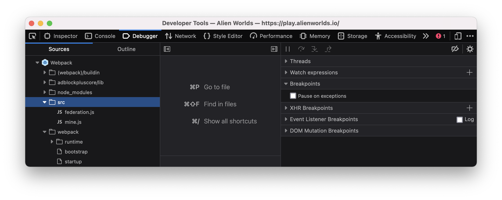

# @limitlesswax/alienworlds

https://alienworlds.io/ npm package

## Usage

This module is only an extracted set of sources from the AlienWorlds site for use in limitlesswax applications only.

## Extraction

To update this package, visit https://alienworlds.io/ and inspect the developer console.



Copy everything in the `src` directory and paste it into the `src` directory of this repo. Note that `index.ts` is actually provided by
this package and should export all symbols from all modules.

Next run `npm run typings` to generate typings. Note you'll have to split this file into the coresponding `.d.ts` files per module and add a prefix of of `@limitlesswax/alienworlds` to each module:

```diff
diff --git a/federation.d.ts b/federation.d.ts
index 98fa733..f2ed45a 100644
--- a/federation.d.ts
+++ b/federation.d.ts
@@ -1,5 +1,5 @@

-declare module "federation" {
+declare module "@limitlesswax/alienworlds/federation" {
     export function stake(token_account: any, federation_account: any, account: any, planet_name: any, quantity: any, eos_api: any): Promise<any>;
     export function unstake(federation_account: any, token_account: any, account: any, planet_name: any, quantity: any, eos_api: any): Promise<any>;
     export function refund(federation_account: any, account: any, refund_id: any, eos_api: any): Promise<any>;
diff --git a/mine.d.ts b/mine.d.ts
index 111c41d..905286e 100644
--- a/mine.d.ts
+++ b/mine.d.ts
@@ -1,4 +1,4 @@
-declare module "mine" {
+declare module "@limitlesswax/alienworlds/mine" {
     export function setPlayerData(federation_account: any, account: any, eos_api: any, tag?: string, avatar_id?: number, permission?: string): Promise<any>;
     export function setTagData(federation_account: any, account: any, eos_api: any, tag: any, permission?: string): Promise<any>;
     export function getBag(mining_account: any, account: any, eos_rpc: any, aa_api: any): Promise<any>;
```

The code is either mangled or contains bugs so the `npm run lint:fix` script should be run to help identify and correct these issues to avoid runtime errors.

Finally, update the version in `package.json` and commit the results.

## Releases

New packages can be published by creating a new release in Github.
